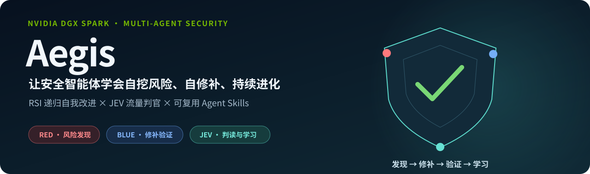
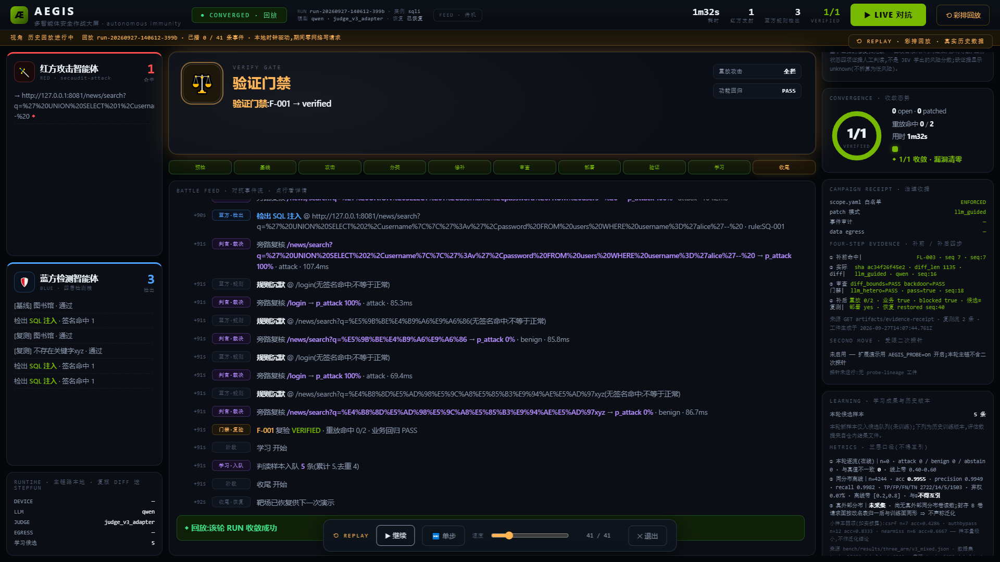
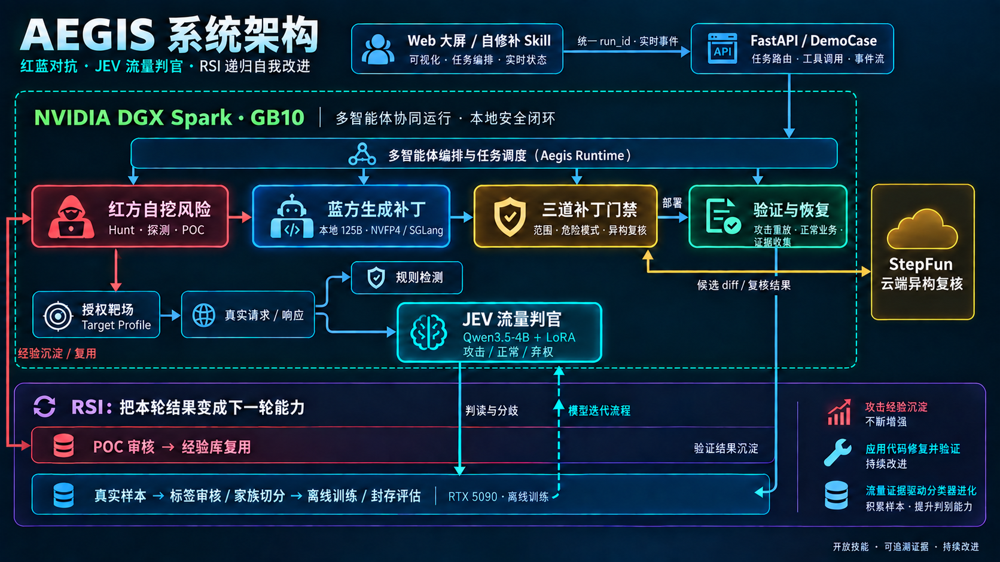
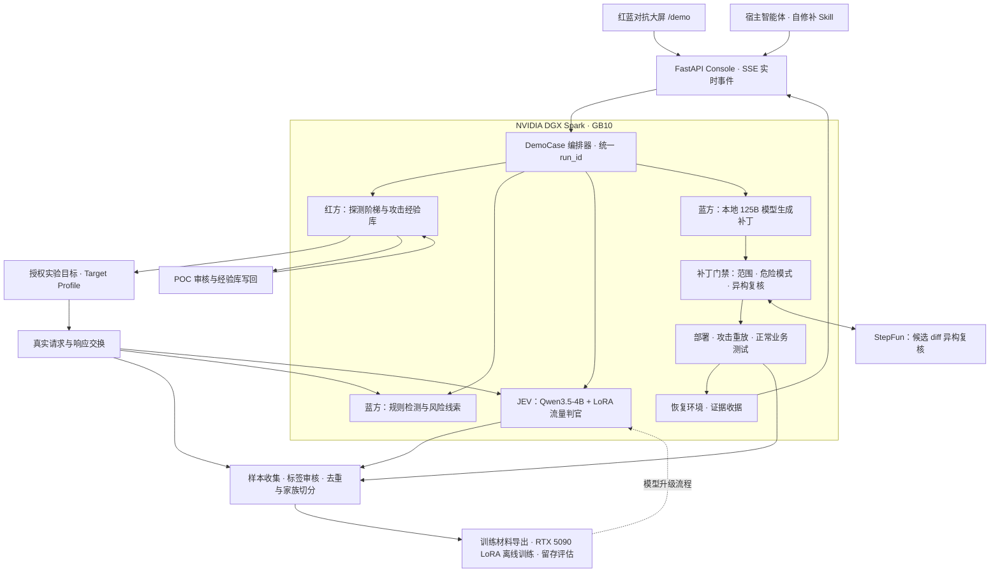

<p align="center"></p>

<p align="center"><strong>红蓝对抗 · 模型自修补 · JEV 流量判官 · 递归自我改进</strong><br/>运行于 NVIDIA DGX Spark 的多智能体安全改进系统</p>

<p align="center"><a href="https://github.com/okone1995/aegis-dgx-spark/releases">演示与下载</a> · <a href="#核心优势">核心优势</a> · <a href="#系统架构">系统架构</a> · <a href="#快速开始">快速开始</a> · <a href="docs/ten-days.md">十日谈</a></p>

## 项目是什么

**Aegis（神盾）是一套让安全智能体具备风险发现、代码修补与持续学习能力的开源系统。** 红方在授权环境中寻找漏洞，蓝方调用模型生成修补代码，JEV 小模型独立判断流量；攻击复测、正常业务测试与运行证据共同验证改进结果。

项目从保险业务对数据安全、业务连续性和审计追溯的需求出发：一次修补既要阻断攻击，也要保证正常业务仍然可用。Aegis 将这个要求落实到每轮运行的代码变更、测试和证据收据中。

我们以 **RSI（Recursive Self-Improvement，递归自我改进）**组织整个系统：每轮对抗不仅修补当前代码，还把有效攻击沉淀到经验库，把真实流量与判读分歧回流为模型学习材料。下一轮可以复用上一轮的发现，持续积累更强的安全能力。

**一次对抗，获得三份成果：经过复测的代码修补、可复用的攻击经验、面向下一轮训练的流量样本。**

## 核心优势

### 1. RSI 把对抗结果变成下一轮的能力

Aegis 连接“发现 → 判读 → 修补 → 复测 → 经验与样本回流”，使发现有后续、修补有验证、经验有去处。在同一已知目标的实测中，红方首次用 **21 次请求**找到有效路径；经过审核入库后，下一轮仅用 **3 次请求**命中。改进来自可追溯的经验复用。

### 2. 模型实际修改代码，攻击与业务双重复测

蓝方由 DGX Spark 本地 **125B 模型**生成候选补丁，经改动范围、危险模式、StepFun 异构复核三道门禁后部署。主演示完成了“攻击成功 → 实际代码修改 → 同一攻击重放 **0/2** 命中 → 正常业务与 **11 项功能测试通过**”的完整链路，并自动恢复实验环境。

### 3. 自训 JEV 小模型，快速判读真实流量

JEV 基于 **Qwen3.5-4B + LoRA**，以分类方式输出攻击、正常或弃权，和规则检测形成互补。混合域 holdout 的准确率达到 **99.55%**；DGX Spark 单发推理中位时延为 **80.8 ms**。它把对抗流量转化为可分析的判读结果，也帮助定位值得复核的训练样本。

### 4. 充分发挥 DGX Spark 与 NVIDIA 技术栈

系统在 Spark GB10 上部署 **125B NVFP4 / SGLang 补丁生成服务**与 **4B bf16 JEV 判官**，结合本地大模型生成、小模型分类、异构模型复核和实时前端展示。模型、智能体与工程编排在同一项目中协同工作。

### 5. 四个 Skills，把能力交给其他智能体

发现风险、积累经验、自修补、整理训练材料分别封装为独立技能，提供 CLI、JSON 结果与可核验工件。真实技能演示中，宿主依次调用 `selftest → start → status → verdict`，得到 `verified_restored`，**17/17 项收据核验通过**。其他智能体可以通过这些入口调用 Aegis 的工作流。

### 6. 过程看得见，结果查得到

FastAPI 与 SSE 将每轮红蓝对抗、JEV 判断、补丁 diff、门禁、复测和恢复展示在同一大屏；统一 `run_id` 把前端故事与后台证据串起来。r4 提交版的公开离线验收覆盖 **73 项测试、16 项子测试与 39 项数值对账**，视频、PPT、模型成绩和运行工件一起交付。

## 看一次完整演示

<p align="center"></p>

| 演示材料 | 看点 |
|---|---|
| [四分钟完整演示](workspace/video/aegis-final-demo-20260929.mp4) | 保险安全需求 → 红蓝对抗 → JEV 判读 → 模型修补与复测 → RSI 经验回流 → Skills 调用 |
| [44 秒真实 Skills 执行](workspace/video/skills-live/aegis-skills-real-execution-20260929.mp4) | CLI 与实时大屏同屏，中文旁白，等待段标注加速 |
| [9 页项目 PPT](workspace/ppt-final/aegis-dgx-spark-judge-pitch-rsi-20260929.pptx) | 项目价值、RSI、架构、JEV、实测成果与技能复用 |
| [Release 下载](https://github.com/okone1995/aegis-dgx-spark/releases) | 一次下载源码、演示材料和证据 |

## 系统架构

<p align="center"></p>

<details>
<summary>展开查看架构连接细节（Mermaid）</summary>



</details>

Web 大屏和自修补 Skill 共用后台运行入口，`DemoCase` 按阶段推进并记录事件；探测、经验写回和训练材料整理也提供独立 CLI。JEV 负责流量分类，StepFun 负责候选补丁的异构复核，攻击与业务复测负责验证实际修补效果。

## 一轮 RSI 怎样运行

| 步骤 | 阶段 | 主要动作 | 产物 |
|---|---|---|---|
| 1 | 建立业务基线 | 加载目标 profile、确认正常请求与业务断言 | 目标身份、基线交换 |
| 2 | 红方发现风险 | 阶梯探测、差分对照、已审核攻击经验检索 | 可复现发现、POC 与响应证据 |
| 3 | 规则与 JEV 判读 | 分别评估真实流量，记录判断和分歧 | 告警、JEV 概率与判读结果 |
| 4 | 蓝方生成修补 | 本地模型根据发现生成候选代码 diff | 原代码、候选代码、补丁哈希 |
| 5 | 补丁门禁 | 检查改动范围、危险模式并进行异构复核 | 门禁结果与审查记录 |
| 6 | 部署与双重复测 | 重放同一攻击，同时检查正常业务和功能测试 | 攻击结果、业务断言、测试结果 |
| 7 | 恢复与归档 | 恢复实验环境，核验同轮工件 | 收据、事件台账、部署身份 |
| 8 | 经验与样本回流 | 审核 POC 入库，审核流量标签并导出学习材料 | 下轮可复用经验、判官训练材料 |

RSI 在这里同时作用于**攻击策略、应用代码与判官学习材料**。历史对抗材料已经完成 JEV v3 的训练、评估与 Spark 部署；新一轮产生的经验和候选样本继续进入审核与学习流程。

## JEV：对抗系统中的小模型判官

JEV 将真实请求与响应渲染成判读输入，通过受限首 token softmax 得到 `p_attack`，再输出攻击、正常或弃权。分类协议、训练数据、模型评估和部署元数据贯通，方便比较模型版本与追溯每条判断。

### 模型与训练

| 项目 | 配置 |
|---|---|
| 底座 | Qwen3.5-4B |
| 微调 | LoRA，r=16，α=32，dropout=0.05，7 个投影模块 |
| 数据 | edu-lite 与外部 DVWA / hack-skills 混合域 |
| 训练规模 | 17,403 条训练样本，4,244 条 holdout |
| 切分 | 按家族切分，训练与 holdout 家族重叠为 0 |
| 训练环境 | RTX 5090，bf16，3 epoch |
| 部署环境 | DGX Spark GB10，bf16 合并权重推理 |

### 实测成绩

| 测试项 | 结果 |
|---|---|
| 混合域 holdout，n=4,244 | **准确率 99.55%** |
| 留存 B 卷，n=7,266 | **准确率 99.92%** |
| Spark 单发推理 median / p95 | **80.8 ms / 118.5 ms** |
| Spark 单发吞吐 | **12.17 条/秒** |
| Spark 与 5090 同 60 条逐条对账 | **判定零翻转** |

成绩对应的数据集、协议与原始结果见 [claims.yaml](claims.yaml) 和 [bench/](bench/)。JEV 与规则检测的互补、训练材料审核及版本管理见 [项目技术文档](docs/PROJECT-DOC-20260928.md)。

## Agent Skills：把安全能力交给其他智能体

| Skill | 能力 | 典型产物 |
|---|---|---|
| [`aegis-hunt`](skills/aegis-hunt/SKILL.md) | 按 scope 和预算发现授权目标的风险 | 探测记录、真实交换、可复现发现 |
| [`aegis-evolve`](skills/aegis-evolve/SKILL.md) | 审核 POC 候选并写回经验库，供下轮检索复用 | 审核状态、来源记录、经验库条目 |
| [`aegis-self-repair`](skills/aegis-self-repair/SKILL.md) | 发起已登记案例的修补、跟踪状态并核验收据 | run_id、终态、17 项证明与证据引用 |
| [`aegis-jevtrain`](skills/aegis-jevtrain/SKILL.md) | 收集样本、配对、审核标签并导出训练材料 | 候选队列、标签审计、数据卷与质量门禁 |

每个技能包包含 `SKILL.md`、执行脚本、契约、测试、参考资料与操作员样例。接入时，宿主智能体加载技能说明并调用 CLI；部署方提供模型服务、目标登记和授权 scope。技能调用返回结构化结果，方便其他智能体继续决策和核验。

真实调用记录见 [Skills 运行工件](evidence/skill-run-run-20260928-155647-3290/)。

## 项目代码结构

```text
aegis-dgx-spark/
├── console/
│   ├── backend/main.py       # FastAPI、运行入口、SSE 与静态页面托管
│   └── frontend/             # Console 前端
├── demo/index.html           # 红蓝对抗、JEV、补丁与验证大屏
├── engine/
│   ├── demo_case.py          # 单轮闭环编排
│   ├── hunt.py               # 红方阶梯探测与交换取证
│   ├── ladders/              # SQLi、LFI、IDOR 等探测阶梯
│   ├── judge_service.py      # JEV 模型服务
│   ├── patcher.py            # 补丁生成与应用
│   ├── patch_review.py       # 候选补丁复核
│   ├── verify.py             # 攻击与业务复测
│   ├── jevtrain.py           # 样本审核、配对与导出
│   ├── target_profile.py     # 靶场 profile 与适配
│   └── run_store.py          # 运行状态和事件台账
├── skills/
│   ├── aegis-hunt/
│   ├── aegis-evolve/
│   ├── aegis-self-repair/
│   └── aegis-jevtrain/
├── targets/                  # 目标 profile 与登记配置
├── governance/               # scope 与载荷策略
├── harness/stepcode/          # 本地模型调用适配
├── dataset/                  # 数据构建、材料快照与候选队列
├── bench/train/              # LoRA 训练与 logit 评估
├── tools/                    # 操作员工具、数据处理与验收
├── tests/                    # 引擎、数据链与技能测试
├── evidence/                 # 主闭环、技能调用、经验复用等运行证据
├── workspace/
│   ├── video/                # 完整演示与真实技能短片
│   └── ppt-final/            # 项目路演 PPT
├── docs/                     # 技术文档、开发历程和使用说明
├── requirements.txt
└── README.md
```

## 快速开始

准备 **Python 3.12** 和 Git。普通 CPU 环境即可运行公开离线验收、查看训练材料报告并启动前端与 API。

### 1. 获取项目并安装依赖

```bash
git clone https://github.com/okone1995/aegis-dgx-spark.git
cd aegis-dgx-spark
python -m venv .venv
```

Linux / macOS：

```bash
source .venv/bin/activate
python -m pip install -r requirements-lock.txt
```

Windows PowerShell：

```powershell
.\.venv\Scripts\python.exe -m pip install -r requirements-lock.txt
```

下面命令使用 `python`；Windows PowerShell 可将它替换为 `.\.venv\Scripts\python.exe`。

### 2. 运行公开验收

```bash
python tools/doctor.py --offline
python -m pytest -q -rs --import-mode=importlib tests skills/aegis-hunt/tests skills/aegis-self-repair/tests skills/aegis-jevtrain/tests skills/aegis-evolve/tests
python bench/train/assert_claims.py --public
```

开发环境先自检，再运行 CPU 回归与四个技能桥接测试；公开数值核对会列明需要私有原始证据的未检条目。当前代码的结果见 [开发验收记录](docs/development/regression-final.json)。[VALIDATION.json](VALIDATION.json) 是 r4 提交版的历史验收记录，不能代表这轮修改。

### 3. 查看学习材料与 Skill 接口

```bash
python tools/_jevtrain_cli.py report
python skills/aegis-self-repair/scripts/aegis_skill.py --help
```

第一条命令查看候选流量材料的分布与审核状态；第二条显示自修补接口与参数。准备好操作员 scope 后，可依次执行 `selftest → start → status → verdict`。四个技能的调用方式与操作员配置均位于对应技能目录。

### 4. 启动 Web 控制台

```bash
python -m uvicorn console.backend.main:app --host 127.0.0.1 --port 8000
```

访问 **[http://127.0.0.1:8000/demo](http://127.0.0.1:8000/demo)** 查看演示界面，访问 `/docs` 查看 FastAPI 接口。配置下一节的模型与授权实验目标后，即可通过界面或 Skill 发起现场运行。

## DGX Spark 部署与扩展

| 组件 | 现场配置 | 职责 |
|---|---|---|
| 本地补丁模型 | Spark · SGLang · 125B NVFP4，`:30000` | 根据发现生成候选代码修补 |
| JEV 服务 | Spark · Qwen3.5-4B + v3 LoRA，`:30002` | 判读流量并记录模型元数据 |
| StepFun | API 密钥通过环境变量配置 | 复核候选补丁 diff |
| FastAPI Console | `:8000` | 创建运行、输出 SSE 事件和展示证据 |
| 授权实验目标 | target profile、业务断言与操作员 scope | 提供可复现对抗、验证与恢复环境 |

**接入新目标**：通过 `targets/`、`engine/target_profile.py` 和目标登记表配置目标地址、源码位置、认证方式与验证逻辑。引擎将目标信息数据化，探测与修补工作流可以沿用统一的运行协议。

**接入新宿主智能体**：加载对应 `SKILL.md`，使用 CLI 和 JSON 契约调用 Aegis。`aegis-self-repair` 通过 `AEGIS_CONSOLE_ORIGIN` 接入后台；操作员准备并固定授权 scope，智能体据此执行任务。

**扩展判官学习材料**：沿用“真实交换 → 标签审核 → 去重 → 家族切分 → 质量门禁 → 导出”的数据链，再调用 `bench/train/` 中的训练与评估工具。权重与实验环境按部署需求分别配置，便于研究者复用不同模型和目标。

本轮开发改动与验收范围见 [开发说明](docs/DEVELOPMENT.md)和[硬化记录](docs/development/HARDENING.md)。

## 文档与开发历程

| 文档 | 内容 |
|---|---|
| [项目技术文档](docs/PROJECT-DOC-20260928.md) | RSI、架构、模型协议、迭代记录与技术细节 |
| [十日谈](docs/ten-days.md) | 从红蓝对抗到 DGX Spark、JEV 与 Skills 的开发过程 |
| [演示脚本](docs/video-script.md) | 四分钟演示的故事线与现场证据 |
| [技能使用与验收说明](docs/SKILLS-SUPPORT.md) | 技能配置、支持范围与验收记录 |
| [发布记录](RELEASE.md) | 部署来源、交付版本与模型元数据 |
| [安全使用说明](SECURITY-AND-USE.md) | 授权实验环境与使用约定 |

项目采用 [MIT License](LICENSE)。第三方组件与资料见 [THIRD-PARTY.md](THIRD-PARTY.md)。欢迎围绕目标适配、攻击经验复用、流量分类和智能体自修补开展研究与贡献。
